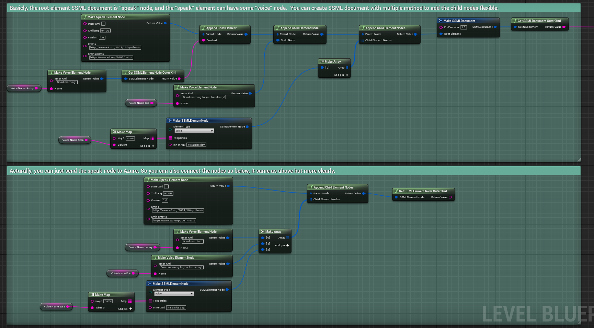
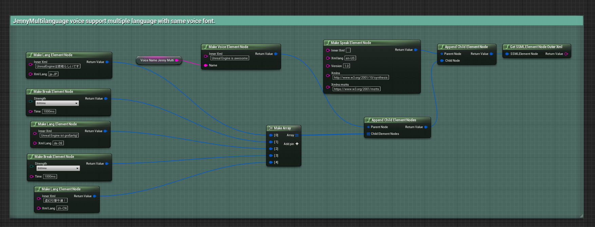
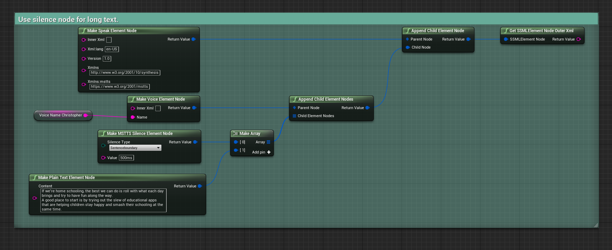
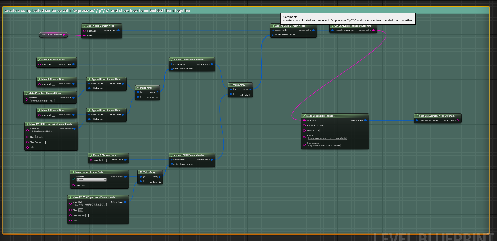
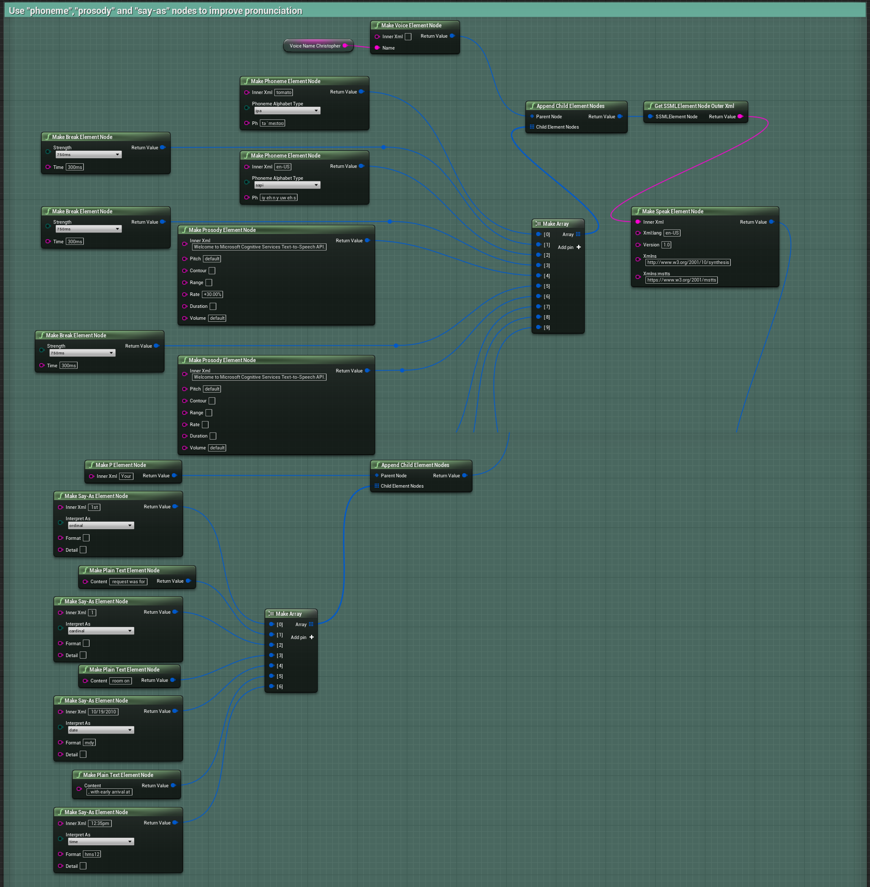

# Unreal Engine Azure TTS(Text-To-Speech) plugin
[English Version](Readme.md)
## 为什么使用Azure TTS
使用Azure TTS可以方便的构建带有更贴近自然的发音，并支持70多种语言250多种银色的应用和游戏。
## 如何使用
- 注册Azure订阅账号
- 创建一个Azure的语音服务
- 下载本插件到你的Unreal Engine或者Unreal Engine的工程中
- 参考下面的演示编写你的蓝图或者C++代码
- 感受下Azure TTS的魅力...

## 一些有用的Azure TTS相关的文档
- [Azure TTS RestAPI](https://docs.microsoft.com/en-us/azure/cognitive-services/speech-service/rest-text-to-speech)
- [Azure TTS SSML](https://docs.microsoft.com/en-us/azure/cognitive-services/speech-service/speech-synthesis-markup)

## 免费的吗？
是的，本插件当然是免费而且开源的。
Azure订阅中，如果你使用免费层级的服务的话也是免费。您可以参考下面Azure关于语音服务相关的价目了解详情。 
[Azure Speech 价格](https://azure.microsoft.com/en-us/pricing/details/cognitive-services/speech-services/) here.

## 使用步骤...
### 获取TTS Token (可选)
如果你使用订阅Key的方式，或者从其他途径获取Token则此步骤可选。

### 获取Azure端点上的语音名(可选)
如果你知道你要使用的语音的名称，则可选。

### 发送SSML结构的文本数据到Azure上获得语音数据

本插件仅仅只是获得语音的**原始数据**, 您可以根据自己的实际需求来后继使用，例如存储到磁盘上，或者使用一些其他插件/或者编写代码来播放它。下面演示使用"Runtime Audio Importer"这个插件将音频数据转换为Soundwave并播放。

### 如何构造你想要说的话为SSML?
首先你需要先理解什么是 SSML? emmm...其实这玩意儿很简单，但是也很麻烦。如果有时间，你应该仔细的阅读微软官方的文档[Azure TTS SSML document](https://docs.microsoft.com/en-us/azure/cognitive-services/speech-service/speech-synthesis-markup) 。

下面是一些示例来展示如何在蓝图中构造SSML节点。

## FAQ
- **插件的兼容性?:** 本插件在UE4.27下开发，常在在UE4.26的工程中也可以使用.如果您在其他版本的UE工程中直接使用我的源代码，可能需要做点小的修改。
- **TTS转换时得到400错误:** 通常情况是SSML构造错误，或者你使用的音色不支持你设定的一些参数。