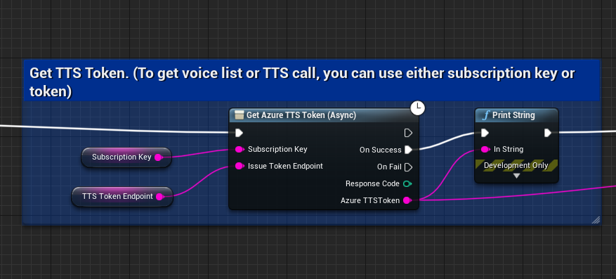
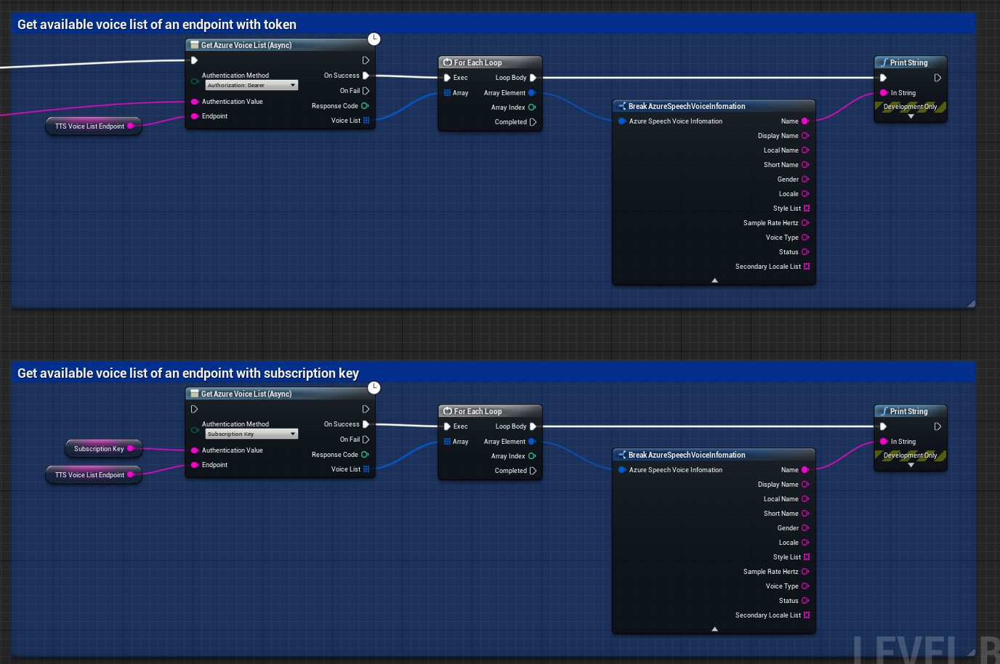
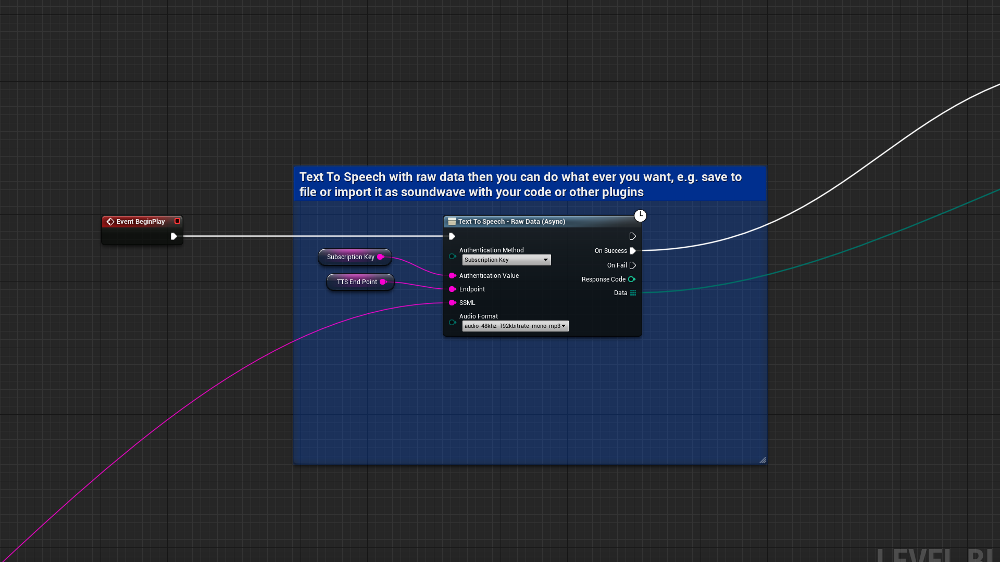
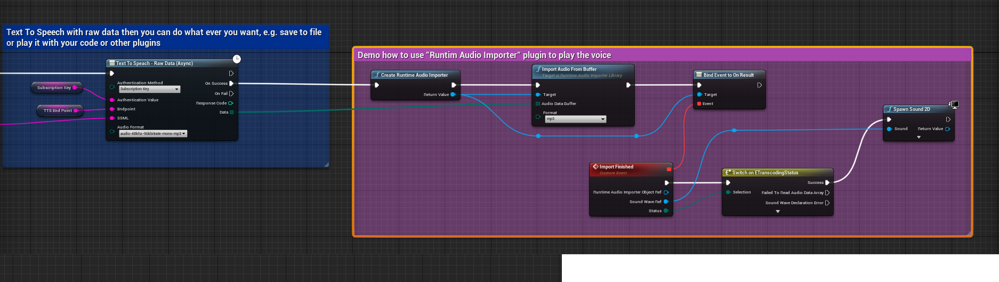
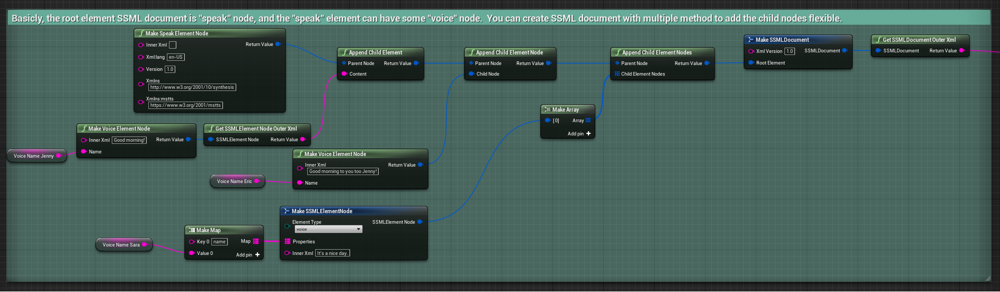
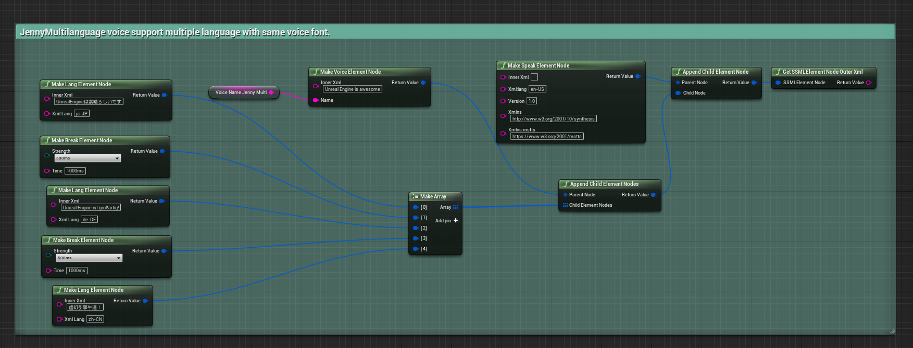
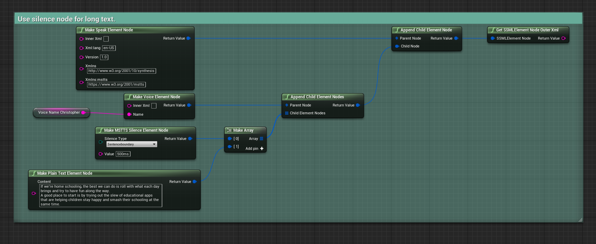
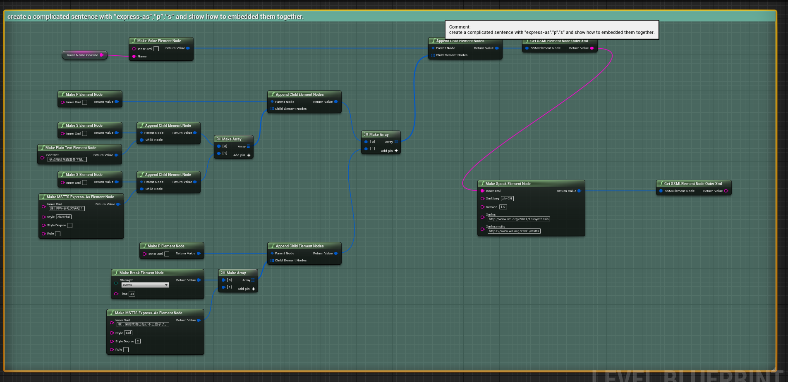
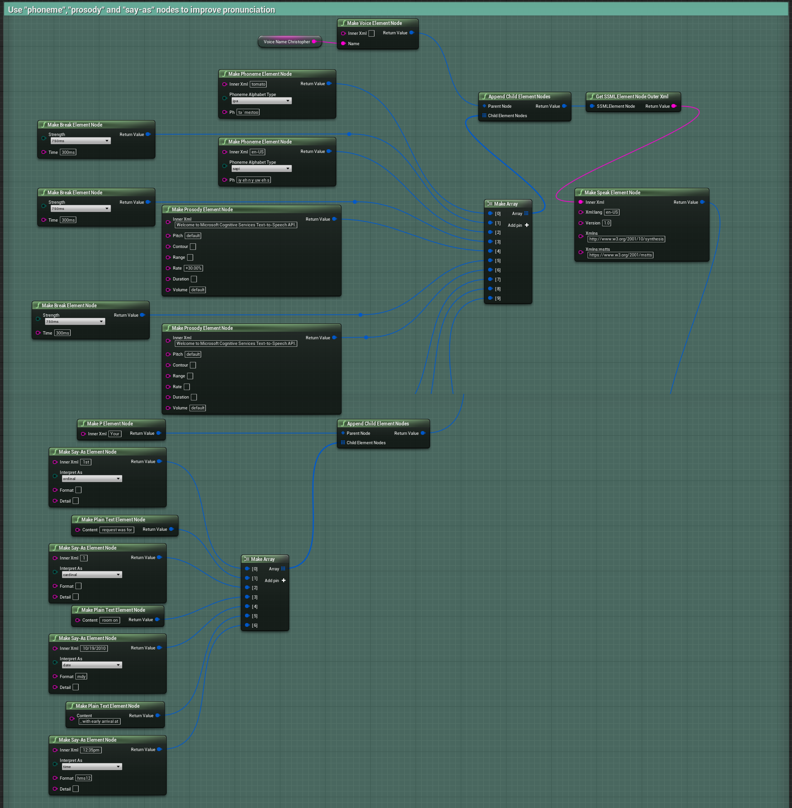

# Unreal Engine Azure TTS(Text-To-Speech) plugin

## Why Azure TTS
Build apps and games that speak naturally, choosing from more than 250 voices and over 70 languages and variants. 
Differentiate your brand with a customized voice, and access voices with different speaking styles and emotional tones to fit your use case.

## How to use
- Register an Azure subscription
- Create an Azure speech service
- Download this plugin in your Unreal Engine
- Write your Blueprint/C++ code and reference the demo.
- Enjoy it...

## Some useful Azure TTS document
- [Azure TTS RestAPI](https://docs.microsoft.com/en-us/azure/cognitive-services/speech-service/rest-text-to-speech)
- [Azure TTS SSML](https://docs.microsoft.com/en-us/azure/cognitive-services/speech-service/speech-synthesis-markup)

## Is this free?
Yes, this unreal engine plugin is free. 
Azure subscription can be also free if you use the Free layer services. More detail of azure speech price please refer to the [official document](https://azure.microsoft.com/en-us/pricing/details/cognitive-services/speech-services/) here. 

## Using...
### Get TTS token (optional if use the subscription key to call the others)

### Get voice list of your endpoint(optional if you know what's the voice you use)

### Send the text as SSML struct to azure to get the voice data.

This plugin just get the **raw data** of the audio, you can process the raw data as your wish. e.g. save to local or play it.
The following just show how to use other plugin "RuntimeAudioImpoter" to play it.

### How to organize your text as SSML?
What's the SSML? emmm...it's very easy but also hard to use. You should read [Azure TTS SSML document](https://docs.microsoft.com/en-us/azure/cognitive-services/speech-service/speech-synthesis-markup) very carefully.
There are some examples show how to use the blueprint to build your SSML.

## FQA
- **Compatibility?:** Sorry, I just tested it in UE 4.27.
- **TTS 400 error:** SSML struct error, or some tag not compatible with your selected voice.